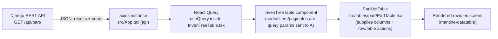

# The Parts Table, Explained Step by Step

Scope: this document only looks at `src/frontend/` (the InvenTree SPA). All file paths below are
relative to `src/frontend/` unless stated otherwise.

Companion document: [`FRONTEND_DEVELOPER_GUIDE.md`](FRONTEND_DEVELOPER_GUIDE.md) covers the general
table system. This document walks through **one concrete table** — the Parts list — line by line.

---

## 1. High-Level Overview

### What it does

The Parts table shows a paginated, sortable, filterable, searchable list of Parts. It lets a user:

- browse/search/filter parts
- select multiple parts and bulk-set their category, or order them
- create a new part, duplicate a part, import parts from a file or a supplier plugin
- click a row to open that part's detail page

It shows up in more than one place — e.g. inside a Part Category's detail page (as the "Parts" tab)
and inside a Stock Location's detail page — because it's a reusable component, not a page of its own.

### How data flows, in one picture



In words: the browser asks the backend for a page of parts (with sort/filter/search/page params
baked into the request), the backend replies with JSON, the generic table engine
(`InvenTreeTable.tsx`) turns that JSON into rows using the column definitions that `PartTable.tsx`
supplied, and mantine-datatable paints it on screen.

---

## 2. Table Creation

### 2.1 Which component renders the table?

Two components work together, in a **generic engine + specific config** pattern:

| Component | File | Role |
|---|---|---|
| `PartListTable` | [`src/tables/part/PartTable.tsx:232`](src/frontend/src/tables/part/PartTable.tsx) | The "Parts table" itself — supplies columns, filters, row actions, toolbar actions, and the API URL. |
| `InvenTreeTable` | [`src/components/tables/InvenTreeTable.tsx:960`](src/frontend/src/components/tables/InvenTreeTable.tsx) | The generic engine used by **every** table in the app — does the actual fetching, sorting, filtering, pagination, and rendering. |

`PartListTable` never talks to `mantine-datatable` or `axios` directly — it just fills in the blanks
that `InvenTreeTable` needs:

```tsx
// src/tables/part/PartTable.tsx:472-492
<InvenTreeTable
  url={apiUrl(ApiEndpoints.part_list)}
  tableState={table}
  columns={tableColumns}
  props={{
    ...props,
    enableDownload: true,
    modelType: ModelType.part,
    tableFilters: tableFilters,
    tableActions: tableActions,
    rowActions: rowActions,
    enableSelection: true,
    enableReports: true,
    enableLabels: true,
    params: {
      ...props?.params,
      category_detail: true,
      location_detail: true
    }
  }}
/>
```

Where `PartListTable` is used (i.e. where you'll actually see this table on screen):

- `src/pages/part/CategoryDetail.tsx` — the "Parts" tab of a Part Category's detail page.
- `src/pages/stock/LocationDetail.tsx` — parts stored in a Stock Location.
- `src/tables/part/PartVariantTable.tsx` — a part's variants.

### 2.2 Which component creates the columns?

The **column list** is built by a plain function inside `PartTable.tsx` itself:

```tsx
// src/tables/part/PartTable.tsx:56 (function signature)
function partTableColumns(): TableColumn[] { ... }
```

It's called once per table instance and memoized so it isn't rebuilt on every render:

```tsx
// src/tables/part/PartTable.tsx:245
const tableColumns = useMemo(() => partTableColumns(), []);
```

Most individual columns aren't written by hand — they're built by **shared column-factory
functions** from [`src/components/tables/ColumnRenderers.tsx`](src/frontend/src/components/tables/ColumnRenderers.tsx),
which encapsulate rendering/sorting/filtering logic that's reused by dozens of other tables
(Stock, Build, Purchase Order, etc.).

### 2.3 How rows are rendered

`InvenTreeTable` doesn't build its own `<table>` — it delegates to the third-party
**`mantine-datatable`** library's `<DataTable>` component:

```tsx
// src/components/tables/InvenTreeTable.tsx:902 (simplified)
<DataTable
  columns={tableColumns}
  records={data}
  sortStatus={sortStatus}
  onSortStatusChange={handleSortStatusChange}
  page={tableState.page}
  onPageChange={...}
  onRowClick={handleRowClick}
  pinLastColumn={tableProps.rowActions != undefined}
  ...
/>
```

`DataTable` iterates the fetched `data` array and, for each row, iterates the `columns` array —
for each column it either shows the raw field value (`accessor`) or calls that column's `render()`
function if one was supplied (this is how the stock-quantity hover card and the row-actions menu
get drawn — see §5).

### 2.4 Sorting / filtering / pagination / selection

All four are handled **entirely inside `InvenTreeTable.tsx`** — `PartTable.tsx` only has to *enable*
them and, for filters, supply the filter list. Nothing about sorting/paging/selecting is
Parts-specific.

- **Sorting**: server-side. Any column with `sortable: true` (e.g. `revision`, `units`,
  `total_in_stock`) becomes clickable in the header. Clicking updates `sortStatus`
  (`InvenTreeTable.tsx:473`), which is translated into an `ordering=`/`-ordering=` query parameter
  sent to the backend (`getOrderingTerm()`, `InvenTreeTable.tsx:564-576`). A column can override
  which backend field it sorts by via `ordering` — e.g. the `price_range` column sorts by
  `ordering: 'pricing_max'` (`PartTable.tsx:205`) even though its `accessor` is `price_range`.
- **Filtering**: `PartTable.tsx:247` builds the filter list once: `useMemo(() => PartTableFilters(), [])`.
  `PartTableFilters()` ([`src/tables/part/PartTableFilters.tsx:9`](src/frontend/src/tables/part/PartTableFilters.tsx))
  returns an array of `TableFilter` objects (`active`, `locked`, `assembly`, `has_stock`,
  `low_stock`, `virtual`, `starred`, tags, etc. — 20+ filters). These populate the funnel-icon
  filter drawer; picking one adds it as a query parameter on the next fetch.
  `useTable()` also seeds one filter as active by default: `initialFilters: [{ name: 'active', value: 'true' }]`
  (`PartTable.tsx:250-256`), so the table only shows active parts until the user changes that.
- **Pagination**: server-side, offset/limit, with page-size options `[10, 15, 20, 25, 50, 100, 500]`
  — entirely built into `InvenTreeTable`/`mantine-datatable`; `PartTable.tsx` does nothing to enable
  this (pagination is on by default).
- **Selection**: turned on with `enableSelection: true` (`PartTable.tsx:483`). Selected rows are
  tracked in the table's state object (`table.selectedRecords` / `table.selectedIds`), which is what
  powers the "Set Category" and "Order Parts" bulk actions in the toolbar (see §5.3).

---

## 3. API Layer

### 3.1 Which API endpoint is called?

**`GET /api/part/`** — defined as `ApiEndpoints.part_list` in
[`lib/enums/ApiEndpoints.tsx`](src/frontend/lib/enums/ApiEndpoints.tsx), and referenced in
`PartTable.tsx:473`:

```tsx
url={apiUrl(ApiEndpoints.part_list)}
```

`apiUrl()` ([`lib/functions/Api.tsx`](src/frontend/lib/functions/Api.tsx)) turns the enum value into
a real path (prefixing `/api/`). The same `ApiEndpoints.part_list` is reused for creating
(`POST`), editing (`PATCH`), duplicating (`POST`), and bulk-editing (`PATCH`) parts — it's one
endpoint, hit with different HTTP methods depending on the action (see §5 and the Forms section of
the main guide).

Extra query parameters are attached via `params` (`PartTable.tsx:486-490`):
```tsx
params: {
  ...props?.params,        // e.g. { category: id } when shown inside a Category page
  category_detail: true,   // ask the backend to embed the full category object per row
  location_detail: true    // ask the backend to embed the full location object per row
}
```

### 3.2 Which function makes the request, and where does it live?

The actual HTTP call is made **inside the generic engine**, not inside `PartTable.tsx`:

```tsx
// src/components/tables/InvenTreeTable.tsx:598-599 (fetchTableData)
const fetchTableData = async () => {
  const queryParams = getTableFilters(true);
  ...
  return api.get(url, { params: queryParams, timeout: 10 * 1000 }).then((response) => {
    let results = response.data?.results ?? response.data ?? [];
    ...
    tableState.setRecordCount(response.data?.count ?? results.length);
    return results;
  });
};
```

- `api` is the single shared axios instance from `src/App.tsx` (session-cookie authenticated —
  see the main guide's Authentication section).
- `getTableFilters(paginate)` (`InvenTreeTable.tsx:481`) builds the full query-parameter object:
  the table's static `params` (from §3.1), plus the active `TableFilter`s, plus `search=`, plus
  (if paginating) `limit`/`offset`, plus `ordering=`.
- This one `fetchTableData` function is reused by **every table in the app** — Parts, Stock,
  Builds, Orders, everything. `PartTable.tsx` never writes its own fetch code.

### 3.3 How the response is transformed before reaching the table

The Django REST Framework list endpoint replies with:
```json
{ "count": 1234, "next": "...", "previous": null, "results": [ { "pk": 1, "name": "Resistor", ... }, ... ] }
```
`fetchTableData` extracts `results` as the row array and `count` as the total record count
(`tableState.setRecordCount(...)`) for the pagination footer. If a table needs extra
client-side reshaping it can supply `props.dataFormatter`, but **`PartTable.tsx` does not use one** —
the raw `results` array is passed straight through to `mantine-datatable`, and any per-row
computation (like the stock-availability numbers) happens later, inside each column's own `render()`
function (§5.2), not as a pre-processing step.

---

## 4. State Management

### 4.1 Where table state lives

Each table instance gets its own state object from the shared hook **`useTable()`**
([`lib/hooks/UseTable.tsx:19`](src/frontend/lib/hooks/UseTable.tsx)):

```tsx
// src/tables/part/PartTable.tsx:249-256
const table = useTable(tableName ?? 'part-list', {
  initialFilters: [{ name: 'active', value: 'true' }]
});
```

This single `table` object (a `TableState`) carries: current `page`, `searchTerm`, active filters
(`filterSet`), `selectedRecords`/`selectedIds`, `hiddenColumns`, `recordCount`, `isLoading`, and a
`tableKey` string used purely to force refreshes (see next). It's plain React state
(`useState`/`useCallback` inside the hook) — **not** Zustand, and not persisted between page loads
except for a few UI preferences (column order/sort/page-size), which are cached separately via
`lib/states/StoredTableState.tsx`.

### 4.2 How data is fetched and refreshed

- **Fetched**: `InvenTreeTable` runs a React Query `useQuery` whose `queryKey` includes the URL,
  page, params, sort status, active filters, search term, and `tableState.tableKey`
  (`InvenTreeTable.tsx:640-652`). Any change to any of those automatically triggers a re-fetch —
  that's how typing in the search box or clicking a column header updates the table without any
  manual "refetch" call.
- **Refreshed on demand**: to force a reload after a mutation (e.g. after editing/duplicating a
  part, or after the bulk "Set Category" action), the code calls **`table.refreshTable()`**. Look at
  `PartTable.tsx:312` (`onFormSuccess: table.refreshTable` for the edit-part modal) and `:357`/`:367`
  (same for duplicate-part and set-category). Internally, `refreshTable()`
  (`lib/hooks/UseTable.tsx:34-42`) just generates a new random `tableKey`, which changes the
  `useQuery` key and forces React Query to refetch — this project doesn't use
  `queryClient.invalidateQueries()`.

### 4.3 Which hooks/utilities are responsible

| Concern | Hook / utility | File |
|---|---|---|
| Table state (page, filters, selection, key) | `useTable()` | `lib/hooks/UseTable.tsx` |
| Active filter tracking | `useFilterSet()` | `lib/hooks/UseFilterSet.tsx` |
| Data fetching | `useQuery` (inside `InvenTreeTable`) | `src/components/tables/InvenTreeTable.tsx` |
| Create/Edit/Duplicate/Bulk-edit modals | `useCreateApiFormModal`, `useEditApiFormModal`, `useBulkEditApiFormModal` | `src/hooks/UseForm.tsx` |
| Current user / permissions | `useUserState()` | `src/states/UserState.tsx` |
| Global settings (e.g. `PART_COPY_BOM`) | `useGlobalSettingsState()` | `src/states/SettingsStates.tsx` |

---

## 5. Column System

### 5.1 How columns are defined

`partTableColumns()` (`PartTable.tsx:56-225`) returns an array mixing two styles:

1. **Reused factory columns** — call a shared function from `ColumnRenderers.tsx` that already
   knows how to render/sort/filter that kind of data:
   ```tsx
   PartColumn({ part: '', accessor: 'name', filter: ['active', 'locked', 'starred'] }),
   IPNColumn({ accessor: 'IPN' }),
   DescriptionColumn({}),
   CategoryColumn({ accessor: 'category_detail' }),
   DefaultLocationColumn({ accessor: 'default_location_detail' }),
   BooleanColumn({ accessor: 'assembly', defaultVisible: false }),
   LinkColumn({})
   ```
2. **Plain column objects** for anything simple or one-off:
   ```tsx
   { accessor: 'revision', sortable: true },
   { accessor: 'units', sortable: true, copyable: true, filter: 'has_units' },
   ```

Each factory function (e.g. `IPNColumn`, `DescriptionColumn`, `BooleanColumn` — all in
`src/components/tables/ColumnRenderers.tsx`) returns a plain object matching the `TableColumn` type
(`lib/types/Tables.tsx`), pre-filled with sensible defaults (title, sortable, filter) that can still
be overridden by whatever you pass in (`...props` is spread last).

### 5.2 How custom cell renderers work

Any column can supply a `render(record, index?)` function that returns JSX instead of a plain
value. Two real examples from the Parts table:

**a) A shared renderer, used via `PartColumn`** — `RenderPartColumn()`
(`src/components/tables/ColumnRenderers.tsx:48-87`) draws a thumbnail image plus conditional status
icons:
```tsx
export function RenderPartColumn({ part, full_name }: { part: any; full_name?: boolean }) {
  if (!part) return <Skeleton />;
  return (
    <Group justify='space-between' wrap='nowrap'>
      <Thumbnail src={part?.thumbnail ?? part?.image} text={full_name ? part?.full_name : part?.name} hover />
      <Group justify='flex-end' wrap='nowrap' gap='xs'>
        {part?.active == false && <Tooltip label={t`Part is not active`}><IconExclamationCircle color='red' size={16} /></Tooltip>}
        {part?.locked && <Tooltip label={t`Part is Locked`}><IconLock size={16} /></Tooltip>}
        {part?.starred && <Tooltip label={t`...subscribed...`}><IconBell size={16} color='green' /></Tooltip>}
      </Group>
    </Group>
  );
}
```

**b) A one-off renderer, written directly in `PartTable.tsx`** — the `total_in_stock` column
(`PartTable.tsx:83-199`) computes availability (`stock - allocated`), picks a warning color, and
wraps the result in a hover-card:
```tsx
{
  accessor: 'total_in_stock',
  sortable: true,
  filter: ['has_stock', 'low_stock', 'high_stock'],
  render: (record) => {
    // ...compute stock, allocated, available, min_stock, max_stock...
    return (
      <TableHoverCard
        value={<Group gap='xs'><Text c={color} size='sm'>{text}</Text></Group>}
        title={t`Stock Information`}
        extra={extra} // list of <Text> lines: Minimum stock, On Order, Allocations, etc.
      />
    );
  }
}
```
`TableHoverCard` ([`src/components/tables/TableHoverCard.tsx:20`](src/frontend/src/components/tables/TableHoverCard.tsx))
is a small shared component: show a compact value, and reveal extra detail lines on hover.

### 5.3 How action buttons inside columns are implemented

There are two distinct kinds of "action" in this table — **per-row** and **toolbar/bulk** — and they
use two different components.

**Per row** (edit / duplicate icons on each part): `PartTable.tsx` builds a `rowActions` callback
(`PartTable.tsx:377-400`):
```tsx
const rowActions = useCallback((record: any): RowAction[] => {
  const can_edit = user.hasChangePermission(ModelType.part);
  const can_add = user.hasAddPermission(ModelType.part);
  return [
    RowEditAction({ hidden: !can_edit, onClick: () => { setSelectedPart(record); editPart.open(); } }),
    RowDuplicateAction({ hidden: !can_add, onClick: () => { setSelectedPart(record); duplicatePart.open(); } })
  ];
}, [user, editPart, duplicatePart]);
```
`RowEditAction`/`RowDuplicateAction` are preset builders from
[`lib/components/RowActions.tsx`](src/frontend/lib/components/RowActions.tsx). `InvenTreeTable`
automatically appends a hidden `--actions--` column when `rowActions` is supplied
(`InvenTreeTable.tsx:369-396`), rendering a `<RowActions>` dropdown (a Mantine `Menu`) for each row —
`PartTable.tsx` never draws the menu itself, just supplies *what* the menu items should do.

**Toolbar / bulk actions** (Part Actions, Add Parts — shown above the table, not per row):
`PartTable.tsx:402-461` builds two `<ActionDropdown>` elements
([`src/components/items/ActionDropdown.tsx:45`](src/frontend/src/components/items/ActionDropdown.tsx)):
```tsx
<ActionDropdown
  tooltip={t`Part Actions`}
  disabled={!table.hasSelectedRecords}
  actions={[
    { name: t`Set Category`, hidden: !user.hasChangeRole(UserRoles.part), onClick: () => setCategory.open() },
    { name: t`Order Parts`, hidden: !user.hasAddRole(UserRoles.purchase_order), onClick: () => orderPartsWizard.openWizard() }
  ]}
/>
```
These are passed to `InvenTreeTable` as `props.tableActions` (`PartTable.tsx:481`), and rendered
verbatim in the header toolbar by `InvenTreeTableHeader.tsx`.

Both kinds of actions are gated by permission checks (`user.hasChangePermission(...)`,
`user.hasChangeRole(...)`) so buttons are simply hidden for users without the right role.

---

## 6. Step-by-Step Execution Flow

What actually happens, in order, from page load to a rendered table:

1. **User navigates** to, say, a Part Category page. React Router renders
   `pages/part/CategoryDetail.tsx`, which renders a `<PartListTable props={{ params: { category: id } }} />`
   inside one of its `PanelGroup` tabs.
2. **`PartListTable` mounts** (`PartTable.tsx:232`). It:
   - builds the column list once via `useMemo(() => partTableColumns(), [])`
   - builds the filter list once via `useMemo(() => PartTableFilters(), [])`
   - calls `useTable('part-list', { initialFilters: [{ name: 'active', value: 'true' }] })` to get
     a fresh `TableState`
   - sets up several modal hooks (`useCreateApiFormModal`, `useEditApiFormModal`, ...) — these don't
     do anything yet, they just prepare `.open()` functions and modal JSX for later
   - builds `rowActions` and `tableActions` callbacks
3. **`PartListTable` renders `<InvenTreeTable>`**, passing the URL (`apiUrl(ApiEndpoints.part_list)`),
   the table state, the columns, and all the `props` (filters/actions/selection flags).
4. **`InvenTreeTable`** wraps `InvenTreeTableInternal`, injecting `api` (from `useApi()`), `navigate`,
   and URL search params.
5. **`InvenTreeTableInternal` mounts.** It fires two queries:
   - an `OPTIONS` request against the part endpoint (`tableOptionQuery`) to learn field labels for
     column headers
   - the actual data query (`useQuery` with `queryFn: fetchTableData`), which is only `enabled` once
     the cached table settings (page size, column order) have loaded.
6. **`fetchTableData` runs**: builds query params (category filter + `category_detail`/
   `location_detail` + `active=true` + pagination + sort) via `getTableFilters()`, then calls
   `api.get('/api/part/', { params })`.
7. **Backend responds** with `{ count, results }`. `fetchTableData` stores `count` into
   `tableState.recordCount` and returns `results` as the row array to React Query.
8. **`InvenTreeTableInternal` re-renders** with the fetched rows, computes the final column list
   (adding the `--actions--` column if `rowActions` was supplied), and passes everything to
   mantine-datatable's `<DataTable>`.
9. **`DataTable` renders one row per record**, calling each column's `render()` (or just showing the
   raw field) per cell — this is where the part thumbnail, the stock hover-card, and the row-actions
   menu actually get drawn.
10. **User interacts**: clicking a column header updates `sortStatus`; typing in search updates
    `tableState.searchTerm`; picking a filter updates `filterSet`; clicking a row (if `modelType` is
    set — it is: `ModelType.part`) navigates to that part's detail page. Any of these changes the
    `useQuery` key from step 5, so steps 6-9 repeat automatically.
11. **User edits/duplicates/creates a part** via a row action or toolbar action → a modal opens
    (`ApiForm` under the hood) → on success, `table.refreshTable()` is called → `tableKey` changes →
    steps 6-9 repeat, showing the updated data.

---

## 7. How to Build a Similar Table

Use this checklist for a new list view of some other model (e.g. "Suppliers", "Categories", or any
new domain object).

### Components to reuse (don't rewrite these)

- `InvenTreeTable` — [`src/components/tables/InvenTreeTable.tsx`](src/frontend/src/components/tables/InvenTreeTable.tsx)
- Column factories you need — [`src/components/tables/ColumnRenderers.tsx`](src/frontend/src/components/tables/ColumnRenderers.tsx)
  (`DescriptionColumn`, `BooleanColumn`, `StatusColumn`, `LinkColumn`, `UserColumn`, etc.)
- `TableHoverCard` — [`src/components/tables/TableHoverCard.tsx`](src/frontend/src/components/tables/TableHoverCard.tsx) (for any cell needing hover detail)
- `RowEditAction` / `RowDuplicateAction` / `RowDeleteAction` / `RowViewAction` — [`lib/components/RowActions.tsx`](src/frontend/lib/components/RowActions.tsx)
- `ActionDropdown` — [`src/components/items/ActionDropdown.tsx`](src/frontend/src/components/items/ActionDropdown.tsx) (toolbar/bulk actions)

### Functions/hooks to call

- `useTable('your-table-name', { initialFilters?: [...] })` — [`lib/hooks/UseTable.tsx`](src/frontend/lib/hooks/UseTable.tsx)
- `apiUrl(ApiEndpoints.your_model_list, pk?)` — [`lib/functions/Api.tsx`](src/frontend/lib/functions/Api.tsx)
- `useCreateApiFormModal` / `useEditApiFormModal` / `useDeleteApiFormModal` / `useBulkEditApiFormModal` — [`src/hooks/UseForm.tsx`](src/frontend/src/hooks/UseForm.tsx)
- `useUserState()` for permission checks — [`src/states/UserState.tsx`](src/frontend/src/states/UserState.tsx)

### API to connect

- Add (or confirm) the endpoint exists in `ApiEndpoints` —
  [`lib/enums/ApiEndpoints.tsx`](src/frontend/lib/enums/ApiEndpoints.tsx), e.g.
  `your_model_list = 'your-model/'`.
- No custom fetch code is needed — `InvenTreeTable` calls it for you once you pass `url={apiUrl(...)}`.

### Files to create

1. `src/tables/<domain>/<Model>Table.tsx` — the table component (mirror `PartTable.tsx`'s shape:
   a `columns()` function + the exported table component).
2. `src/tables/<domain>/<Model>TableFilters.tsx` — optional, only if you need filters (mirror
   `PartTableFilters.tsx`: export a function returning `TableFilter[]`).
3. `src/forms/<Model>Forms.tsx` — optional, only if you need create/edit forms (mirror
   `src/forms/PartForms.tsx`'s `use<Model>Fields()` hook pattern).

### Files to modify

- Wherever the new table should appear — a page (`src/pages/...`) or a panel inside an existing
  page — import and render your new `<YourModelTable />`.
- `lib/enums/ApiEndpoints.tsx` — if the endpoint doesn't exist yet.

### Step-by-step checklist

- [ ] Confirm the list endpoint exists in `ApiEndpoints` (add it if not).
- [ ] Create `<Model>Table.tsx`; write a `columns()` function using `ColumnRenderers.tsx` factories
      wherever possible, plain objects for simple fields.
- [ ] (Optional) Create `<Model>TableFilters.tsx` with a `TableFilter[]`-returning function.
- [ ] In the table component: call `useTable('unique-name')`.
- [ ] (Optional) Wire up `useCreateApiFormModal`/`useEditApiFormModal`/`useDeleteApiFormModal` for
      create/edit/delete, passing `table` so they auto-refresh on success.
- [ ] Build a `rowActions` callback gated by `user.hasChangePermission/hasAddPermission(...)`.
- [ ] Render:
      ```tsx
      <InvenTreeTable
        url={apiUrl(ApiEndpoints.your_model_list)}
        tableState={table}
        columns={columns}
        props={{ tableFilters, tableActions, rowActions, enableSelection: true, params }}
      />
      ```
- [ ] Drop `<YourModelTable />` into whatever page/panel should show it.
- [ ] Verify: fetch, sort, filter, search, pagination, and row actions all work with **zero** extra
      code beyond the above — if you find yourself writing fetch/sort/filter logic by hand, stop and
      re-check you're using `InvenTreeTable` correctly.

---

## 8. Code Reference Index

| What | File | Symbol |
|---|---|---|
| The Parts table component | `src/tables/part/PartTable.tsx:232` | `PartListTable` |
| Column definitions | `src/tables/part/PartTable.tsx:56` | `partTableColumns()` |
| Filter definitions | `src/tables/part/PartTableFilters.tsx:9` | `PartTableFilters()` |
| Generic table engine (public) | `src/components/tables/InvenTreeTable.tsx:960` | `InvenTreeTable` |
| Generic table engine (internal) | `src/components/tables/InvenTreeTable.tsx:79` | `InvenTreeTableInternal` |
| The actual HTTP fetch | `src/components/tables/InvenTreeTable.tsx:598` | `fetchTableData` |
| Query-param builder (sort/filter/search/page) | `src/components/tables/InvenTreeTable.tsx:481` | `getTableFilters` |
| Table state hook | `lib/hooks/UseTable.tsx:19` | `useTable` (default export) |
| Refresh-on-demand mechanism | `lib/hooks/UseTable.tsx:34` | `refreshTable` |
| API endpoint used | `lib/enums/ApiEndpoints.tsx` | `ApiEndpoints.part_list` → `GET/POST/PATCH /api/part/` |
| URL builder | `lib/functions/Api.tsx` | `apiUrl` |
| Shared column factories | `src/components/tables/ColumnRenderers.tsx` | `PartColumn`, `IPNColumn`, `DescriptionColumn`, `CategoryColumn`, `DefaultLocationColumn`, `BooleanColumn`, `LinkColumn` |
| Part-specific cell render helper | `src/components/tables/ColumnRenderers.tsx:48` | `RenderPartColumn` |
| Hover-card cell decoration | `src/components/tables/TableHoverCard.tsx:20` | `TableHoverCard` |
| Row action menu presets | `lib/components/RowActions.tsx` | `RowEditAction`, `RowDuplicateAction` |
| Toolbar/bulk action dropdown | `src/components/items/ActionDropdown.tsx:45` | `ActionDropdown` |
| Create/Edit/Duplicate/Bulk-edit modal hooks | `src/hooks/UseForm.tsx` | `useCreateApiFormModal`, `useEditApiFormModal`, `useBulkEditApiFormModal` |
| Part form field definitions | `src/forms/PartForms.tsx` | `usePartFields` |
| Permission checks | `src/states/UserState.tsx` | `useUserState().hasChangePermission/hasAddPermission/hasChangeRole/hasAddRole` |
| Pages that render this table | `src/pages/part/CategoryDetail.tsx`, `src/pages/stock/LocationDetail.tsx` | `<PartListTable ... />` |

---

*If any line number above has drifted because the file changed since this was written, trust the
current file over this document — use the symbol names in the table above to re-locate the code with
a search.*
